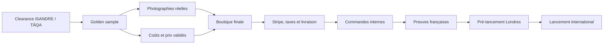

# ISANDRE / ṬĀQA — Plan maître final d'exécution

Version : 27 juillet 2026  
Statut : document directeur à exécuter après validation des portes bloquantes  
Périmètre : produit, identité, images, boutique, commerce, projection, presse,
contenus, lancement et marketing extérieur  
Langue de travail : français  
Langue commerciale principale : anglais  

---

## 0. Fonction du document

Ce document fusionne, sans les remplacer ni les supprimer :

- le dossier de direction artistique `DA Rava 2040` ;
- le brief maître produit et les manifestes géométriques ;
- le cahier fabricant et les études de matériaux ;
- le cahier image et conversion fondé sur 200 références ;
- le cahier marketing extérieur fondé sur 200 références ;
- le code actuel de la boutique ;
- les recherches précédentes sur le naming, le récit, l'identité physique,
  l'authenticité, le commerce international et la projection.

Il constitue l'ordre d'exécution final. Les documents sources restent conservés
comme annexes probantes. Une synthèse ne doit jamais effacer une réserve, une
source, une mesure, un interdit ou une décision plus précise portée par ces
annexes.

### 0.1 Les trois statuts de décision

| Statut | Sens | Conséquence |
|---|---|---|
| `VERROUILLÉ` | Décision créative ou donnée technique déjà arbitrée | Codex peut l'implémenter sans la rediscuter |
| `À VALIDER` | Décision dépendant d'une preuve juridique, physique, fiscale ou commerciale | Le système peut être préparé, mais aucune affirmation publique n'est publiée |
| `ARCHIVE` | Piste étudiée puis remplacée | Conservée pour la traçabilité, jamais réintroduite dans le produit final |

### 0.2 Règle de non-perte

Chaque source est rattachée à au moins une phase d'exécution dans la matrice de
traçabilité de la section 18. Toute future modification du plan devra :

1. nommer la décision modifiée ;
2. citer la source concernée ;
3. expliquer la raison du changement ;
4. décrire l'impact sur le produit, le site, les médias et le commerce ;
5. conserver l'ancienne décision dans le journal des décisions.

### 0.3 Séparation des deux plans

Le document contient deux chemins :

- **Plan A — Création et système automatisable** : tout ce que Codex peut
  concevoir, produire, coder, organiser, tester, documenter et préparer ;
- **Plan B — Exécution extérieure** : ce qui exige une personne, un fabricant,
  un laboratoire, un photographe, un juriste, un transporteur, un partenaire,
  un média ou une dépense réelle.

Le Plan A prépare les outils du Plan B. Le Plan B produit les preuves que le
Plan A publie. Aucun des deux ne remplace l'autre.

### 0.4 Autorité opérationnelle des corpus 400

Les deux cahiers `cahier-images-luxe-corpus-200.md` et
`cahier-marketing-externe-corpus-200.md` ne sont pas de simples documents
d'inspiration. Ils constituent des **annexes normatives** du présent plan :

- 200 références analysées pour l'image, le désir, la preuve et la conversion ;
- 200 références analysées pour l'histoire, la mémorisation, l'influence, la
  presse, les contenus et la croissance extérieure ;
- 40 systèmes de maisons comparés dans chaque cahier ;
- 68 URL externes uniques documentant produits, maisons, UX, recherche,
  canaux, calendrier et conformité.

La règle d'exécution est la suivante :

1. les données produit validées et le golden sample restent prioritaires sur
   toute observation de marché ;
2. les prescriptions chiffrées des cahiers sont obligatoires lorsqu'elles ne
   contredisent pas une vérité produit plus haute dans la hiérarchie ;
3. les anciens noms de maison et de collection présents dans les cahiers sont
   remplacés par ISANDRE / ṬĀQA ; les noms produits encore actifs, dont SEUIL,
   PORTÉE et VEILLE, sont conservés ;
4. les 400 fiches produit ne sont pas copiées dans le plan : elles restent
   consultables comme registre probant et chaque conclusion transférable est
   reliée à une phase d'exécution ;
5. aucune fréquence directionnelle n'est présentée comme une causalité de
   vente ; les faits, observations, inférences et recommandations restent
   distingués ;
6. toute suppression future d'une exigence issue des corpus doit être motivée
   dans le journal de décisions et reliée à une preuve contradictoire.

La matrice détaillée de couverture est tenue dans
`audit-couverture-corpus-400-isandre-taqa.md`. Le plan maître et cette matrice
doivent évoluer dans le même commit.

---

## 1. Ordre d'autorité définitif

En cas de contradiction, l'ordre suivant s'applique.

| Rang | Source | Autorité |
|---:|---|---|
| 1 | `modules/projection/core/reference-kits.data.json` et plans fabricant validés | Dimensions, ouvertures, proportions et géométrie |
| 2 | Golden sample physique approuvé | Matière, couleur, toucher, stabilité et qualité réelle |
| 3 | Documents `17`, `19` et `20` de `DA Rava 2040` | Plaque, finition LLDPE, poids et stabilité |
| 4 | Documents `08`, `09`, `10`, `11` et `14` de `DA Rava 2040` | Maison, collection, récit, identité et authenticité |
| 5 | `00_BRIEF_MAITRE_DA_RAVA_2040.md` | Synthèse produit, usages, ton, interdits et état des vérités |
| 6 | `cahier-images-luxe-corpus-200.md` | Système d'images, désir, conversion et QA média |
| 7 | `cahier-marketing-externe-corpus-200.md` | Marketing, films, presse, collaborations, acquisition et CRM |
| 8 | Code actuel de la boutique | Fonctionnalités existantes à migrer, pas vérité de marque |
| 9 | Anciens plans VIAIRE, RAVA, MURA, FORME OUVERTE, TRAVERSÉE | Archives de recherche uniquement |

### 1.1 Conflits explicitement tranchés

| Sujet | Ancienne piste | Décision finale |
|---|---|---|
| Maison | RAVA, FORME OUVERTE, VIAIRE, CLAVEAU | `ISANDRE` |
| Collection | MURA, SÉRIE O, OUVERTURES, TAKA | `ṬĀQA` en éditorial, `TAQA` en usage courant, sous réserve de clearance |
| Vertical | ÉLAN O1 | `SEUIL 01` |
| Horizontal | PORTÉE O2 | `PORTÉE 02` |
| Chevet | VEILLE O4 | `VEILLE 03` |
| Rose | Plaster Rose / Rose plâtre | `Rose Clay / Argile rose` |
| Signature | Let life through / Une place dans le mur | `THE ROOM CONTINUES. / LA PIÈCE CONTINUE.` |
| Source culturelle | TAQA/ṬĀQA utilisé sans précision | `ṬĀQA` est la translittération éditoriale de `ṭāqa`, formulation à faire valider |
| Logo | arche, croix, monogramme décoratif | wordmark ISANDRE + signe secondaire `L'ENTAILLE` |
| Plaque | disque, rectangle découpé | rectangle plein 42,07 × 26 mm, bronze patiné, signe gravé |
| Image produit | variations libres ou collage 3D visible | photographie complète cohérente, géométrie immuable |
| Atelier | décor généré présenté comme preuve | photographie réelle uniquement |

---

## 2. Plateforme canonique de marque

### 2.1 Architecture

```text
MAISON
ISANDRE

COLLECTION
ṬĀQA

PRODUITS
SEUIL 01
PORTÉE 02
VEILLE 03
```

Statut :

- `ISANDRE` : `VERROUILLÉ CRÉATIVEMENT`, `À VALIDER JURIDIQUEMENT` ;
- `ṬĀQA / TAQA` : `VERROUILLÉ COMME COLLECTION`, `À VALIDER JURIDIQUEMENT ET
  LINGUISTIQUEMENT` ;
- `SEUIL`, `PORTÉE`, `VEILLE` : `VERROUILLÉS CRÉATIVEMENT`, `À VALIDER
  JURIDIQUEMENT`.

### 2.2 Rôle de chaque nom

| Niveau | Fonction |
|---|---|
| ISANDRE | Maison extensible au-delà de la première collection |
| ṬĀQA | Premier chapitre consacré à la place retirée dans la matière |
| SEUIL | Repère vertical qui organise un passage sans construire un mur |
| PORTÉE | Horizon bas qui relie les usages et les deux côtés d'une pièce |
| VEILLE | Architecture intime pour les gestes du soir et du matin |

### 2.3 Formulation culturelle autorisée

Forme éditoriale et culturelle :

> ṬĀQA désigne une niche, un placard ou une ouverture ménagée dans l'épaisseur
> d'un mur. La collection n'en reproduit pas le décor : elle en transpose le
> geste.

Version courte :

> ṬĀQA — une place ménagée dans la matière.

Règle orthotypographique :

- `ṬĀQA` : lancement, éditorial, catalogue, invitation, plaque et certificat ;
- `TAQA` : URL, email, recherche, SKU, références techniques et systèmes qui ne
  gèrent pas correctement les diacritiques ;
- `ṭāqa` : mot source dans une phrase explicative ;
- `TAKA` : piste étudiée dans le document 10, désormais archivée.

Interdits :

- ne pas mélanger `ṬĀQA`, `TAQA` et `TAKA` sans cette hiérarchie ;
- ne pas transformer l'origine en folklore méditerranéen ;
- ne pas utiliser de décor religieux ;
- ne pas inventer de tradition familiale ou artisanale ;
- ne pas revendiquer une origine de fabrication non prouvée.

### 2.4 Système verbal final

| Niveau | Anglais | Français |
|---|---|---|
| Signature de maison | `THE ROOM CONTINUES.` | `LA PIÈCE CONTINUE.` |
| Promesse | `Furniture that structures space without closing it.` | `Des meubles qui structurent l'espace sans le fermer.` |
| Collection | `ṬĀQA — A PLACE MADE IN THE MATERIAL.` | `ṬĀQA — UNE PLACE MÉNAGÉE DANS LA MATIÈRE.` |
| Geste | `Mass holds. Openings let life through.` | `La masse tient. Les ouvertures laissent passer la vie.` |
| Preuve produit | `The room remains visible through every piece.` | `La pièce reste visible à travers chaque meuble.` |

`LET LIFE THROUGH` peut être utilisé comme titre de film ou accroche
d'acquisition. Il ne concurrence pas la signature permanente.

### 2.5 Textes directeurs produits

#### SEUIL 01

Anglais :

> A vertical marker for open rooms. SEUIL gives selected objects a place while
> light, movement and conversation continue through it.

Français :

> Un repère vertical pour les pièces ouvertes. SEUIL donne une place aux objets
> choisis tandis que la lumière, les gestes et les conversations le traversent.

#### PORTÉE 02

Anglais :

> A low horizon between two uses. PORTÉE holds books and objects while both
> sides of the room remain connected.

Français :

> Un horizon bas entre deux usages. PORTÉE accueille livres et objets tandis
> que les deux côtés de la pièce restent reliés.

#### VEILLE 03

Anglais :

> A quiet architecture beside the bed. VEILLE keeps a book, a glass and the
> smallest rituals of night close at hand.

Français :

> Une architecture calme près du lit. VEILLE garde à portée de main un livre,
> un verre et les plus petits rituels de la nuit.

### 2.6 Règles de ton

- L'anglais est la langue commerciale principale.
- Le français est complet, pas résumé.
- Les blocs visibles restent sous 45 mots.
- Le texte nomme une expérience, un usage ou une preuve.
- Le texte ne décrit jamais l'interface.
- Les superlatifs non démontrables sont supprimés.
- Les mots `iconic`, `luxury`, `revolutionary`, `best-seller`, `sold out` et
  `French success` ne sont pas utilisés sans preuve indépendante.

---

## 3. Vérité produit canonique

### 3.1 SEUIL 01

| Donnée | Valeur |
|---|---:|
| Largeur | 1 020 mm |
| Hauteur | 1 840 mm |
| Profondeur | 420 mm |
| Épaisseur visuelle | 80 mm |
| Rayon extérieur | environ 52 mm |
| Socle | 100 mm, retrait 25 mm |
| Ouvertures | exactement 8 |
| Dos | intégralement ouvert |

Règles :

- quatre niches verticales à gauche ;
- une arche dominante en partie haute droite ;
- trois niches horizontales à droite ;
- aucune symétrisation ;
- aucun fond, tiroir, pied, poignée ou roulette ;
- aucune variation de proportions entre les finitions ou les images.

### 3.2 PORTÉE 02

| Donnée | Valeur |
|---|---:|
| Largeur | 1 840 mm |
| Hauteur | 1 020 mm |
| Profondeur | 420 mm |
| Épaisseur visuelle | 80 mm |
| Rayon extérieur | environ 52 mm |
| Socle | 100 mm, retrait 25 mm |
| Ouvertures | exactement 8 |
| Dos | intégralement ouvert |

Règles :

- trois petites niches à gauche ;
- une arche et une niche au centre ;
- trois longues niches à droite ;
- PORTÉE n'est ni une rotation ni un étirement de SEUIL ;
- les montants ne sont jamais visuellement plus fins que ceux de SEUIL ;
- toute vue commerciale doit rendre sa largeur et sa profondeur compréhensibles.

### 3.3 VEILLE 03

Vérité visuelle :

- exactement deux ouvertures ;
- une arche supérieure ;
- une niche horizontale basse ;
- un plateau supérieur continu ;
- un socle continu en retrait ;
- un dos ouvert ;
- aucun tiroir, porte, pied, poignée ou troisième compartiment.

Blocage :

- les dimensions externes ne sont pas validées ;
- les coordonnées et rayons ne sont pas validés ;
- aucune fiche cotée, projection métrique ou promesse industrielle ne peut être
  publiée avant validation fabricant.

### 3.4 Relation de famille

Les trois produits partagent :

- masse monolithique ;
- vide traversant ;
- arche dominante ;
- épaisseur généreuse ;
- socle en retrait ;
- asymétrie maîtrisée ;
- absence de quincaillerie visible ;
- surface continue ;
- silhouette lisible à distance.

Ils ne doivent jamais ressembler à :

- un système modulaire ;
- un empilement ;
- une bibliothèque standard ;
- un meuble en béton de chantier ;
- un jouet ou objet gonflable ;
- une sculpture inutilisable.

---

## 4. Finitions, matière et industrialisation

### 4.1 Noms de finitions

| ID technique cible | Anglais | Français | Rôle |
|---|---|---|---|
| `chalk` | Chalk | Craie | lumière, calme, architecture |
| `butter` | Butter | Beurre | énergie douce, jeunesse, midi |
| `sage` | Sage | Sauge | nature, équilibre, profondeur |
| `rose-clay` | Rose Clay | Argile rose | intimité, culture, soirée |

Les valeurs hexadécimales sont des références d'interface, jamais des standards
de fabrication. Le golden sample physique est la vérité couleur.

Correspondance industrielle :

- `Craie` correspond à un ivoire chaud, jamais blanc optique ;
- `Argile rose` est le nom commercial ;
- `Rose plâtre` reste le nom de travail du coupon industriel actuel ;
- le passage d'un nom à l'autre ne change pas la recette validée du golden
  sample.

### 4.2 Direction sensorielle

La plateforme matière cible est un **LLDPE rotomoulé teinté dans la masse**. La
surface finale doit être :

- teintée dans la masse ;
- presque lisse ;
- satin bas de type peau d'œuf ;
- chaude au toucher ;
- sans grain décoratif visible à distance normale ;
- uniforme sur plans, rayons, niches, avant et arrière ;
- réparable ou remplaçable selon le procédé final.

Objectifs de prototypage LLDPE :

| Mesure | Plage de départ |
|---|---:|
| Brillance à 60° | 8–15 GU |
| Relief optique | environ 30–50 µm maximum visé |
| Peau nominale prototype | 7 mm |
| Structure visuelle | 80 mm |

Coupons obligatoires par finition :

- reliefs de départ `15–30`, `30–50` et `50–80 µm` ;
- brillances de départ `8`, `12` et `15 GU à 60°` ;
- témoin micrograin `80–150 µm` destiné à confirmer son rejet ;
- rayon moulé grandeur réelle ;
- plan de joint et zone de détourage ;
- tests rayure, abrasion, café, vin, huile, crème solaire, savon, alcool
  ménager, UV et réparation.

Interdits :

- faux béton ;
- faux marbre ;
- terrazzo décoratif ;
- plastique brillant ;
- crépi grossier ;
- mouchetis contrasté ;
- couture, joint ou évent visible sur les faces principales ;
- texture numérique uniforme sans comportement matériel crédible.

### 4.3 Hiérarchie industrielle

Les études `19` et `20`, plus récentes et plus spécifiques, fixent le LLDPE
rotomoulé comme direction cible :

- LLDPE grade mobilier ;
- teinté dans la masse ;
- peau nominale initiale de 7 mm ;
- renforts et rapprochements de parois conçus avec le rotomouleur ;
- inserts localisés dans les zones chargées ;
- lest démontable dans le socle ;
- patins invisibles et réglables ;
- anti-basculement livré avec SEUIL ;
- essais de fluage, charge, stabilité, acoustique et transport.

La structure composite GFRP avec cadre aluminium et peau minérale, recommandée
par l'étude `18` pour une faible série européenne, devient le **plan de repli**
uniquement si le prototype LLDPE échoue sur la rigidité, le toucher, le son, le
coût ou la qualité de surface.

Ordre de décision :

1. prototyper les coupons LLDPE ;
2. construire un tronçon de niche et un rayon grandeur réelle ;
3. produire un prototype SEUIL LLDPE ;
4. mesurer toucher, son, flèche, stabilité, réparation, emballage et rendu
   photographique ;
5. activer le prototype composite uniquement si un critère dur échoue ;
6. approuver un golden sample ;
7. seulement ensuite figer le texte matière et le pays de fabrication.

### 4.4 Poids et stabilité

Base d'étude LLDPE :

| Produit | Corps 7 mm | Renforts | Lest | Poids installé cible |
|---|---:|---:|---:|---:|
| SEUIL | ~56 kg | 4–7 kg | 20–25 kg | 80–88 kg |
| PORTÉE | ~58 kg | 4–7 kg | 10–15 kg si requis | 72–80 kg |

Exigences :

- lest démontable dans le socle ;
- patins invisibles, réglables et antidérapants ;
- anti-basculement fourni pour SEUIL ;
- stabilité autonome testée avant recours à l'ancrage ;
- charge, fluage, poussée, traction, tapis, sol dur, transport et acoustique
  testés ;
- protocole à confirmer avec un laboratoire, notamment EN 14749.

### 4.5 Prix de travail

| Produit | Craie | Beurre | Sauge | Argile rose |
|---|---:|---:|---:|---:|
| SEUIL 01 | 3 000 € | 3 200 € | 3 300 € | 3 500 € |
| PORTÉE 02 | 3 000 € | 3 200 € | 3 300 € | 3 500 € |
| VEILLE 03 | 750 € | 800 € | 850 € | 900 € |

Statut : `À VALIDER COMMERCIALEMENT`.

Le site peut être préparé avec ces prix, mais le lancement exige :

- coût rendu entrepôt confirmé ;
- marge par marché ;
- coût d'emballage et livraison ;
- retours et garantie ;
- TVA, droits et frais de paiement ;
- politique de prix multidevise approuvée.

### 4.6 Audit de conformité matière et texture

| Exigence DA Rava 2040 | Présence dans le plan | Statut |
|---|---|---|
| LLDPE rotomoulé grade mobilier | section 4.3 | respecté |
| Teinté dans la masse | sections 4.2 et 4.3 | respecté |
| Peau nominale initiale 7 mm | sections 4.2 à 4.4 | respecté, à contractualiser |
| Presque lisse, satin peau d'œuf | section 4.2 | respecté |
| Brillance 8, 12 et 15 GU à 60° | section 4.2 | respecté, à mesurer |
| Reliefs 15–30, 30–50 et 50–80 µm | section 4.2 | respecté, à prototyper |
| Micrograin 80–150 µm comme témoin de rejet | section 4.2 | respecté |
| Aucun faux béton, marbre ou terrazzo | section 4.2 | respecté |
| Aucun grain lisible à distance normale | section 4.2 | respecté |
| Aucune porosité ouverte, veine ou mouchetis | prescription ci-dessous | respecté |
| Aucun joint ou évent sur les faces principales | section 4.2 | respecté |
| Même traitement sur plans, rayons et niches | section 4.2 | respecté |
| Renforts localisés et lest bas | sections 4.3 et 4.4 | respecté |
| Patins réglables et anti-basculement SEUIL | section 4.4 | respecté |
| Tests de taches, abrasion, UV et réparation | section 4.2 | respecté |
| Composite uniquement comme repli | section 4.3 | corrigé |

Prescription complémentaire :

- aucune porosité ouverte ;
- aucune veine décorative ;
- aucun mouchetis contrasté ;
- aucune peinture masquant une peau de mauvaise qualité ;
- aucune différence de traitement volontaire entre plans et rayons ;
- les rayons peuvent paraître légèrement plus satinés uniquement par leur
  réflexion naturelle ;
- aucune autre couleur ne doit apparaître après une rayure superficielle ;
- le caractère premium vient de la forme, de l'uniformité, des rayons, de la
  masse et de la maîtrise des joints, jamais d'une imitation minérale.

---

## 5. Identité visuelle et physique

### 5.1 Logo

- wordmark principal : `ISANDRE` ;
- capitales dessinées, présence mesurée, pas d'arche ;
- le logo ne doit pas dépendre de ṬĀQA ;
- le signe secondaire est `L'ENTAILLE`.

### 5.2 L'ENTAILLE

Construction :

- bloc rectangulaire dense ;
- ratio vertical 1:1,55 ;
- retrait carré de 0,34 × 0,34 ;
- centre du retrait à 62 % de la hauteur ;
- aucun arrondi ;
- aucune perspective ;
- aucun deuxième retrait ;
- jamais utilisé comme motif répétitif.

### 5.3 Marque d'origine

| Donnée | Décision |
|---|---|
| Forme | rectangle plein |
| Dimensions | 42,07 × 26,00 mm |
| Ratio | 1,618 |
| Rayon | 0,8 mm |
| Matière | bronze siliconé sombre |
| Finition | brossage horizontal fin, patine mate |
| Fixation | affleurante, sans vis visible |
| Position | retour intérieur droit de la niche basse horizontale |
| Retrait avant | 28–32 mm |
| Visibilité | invisible de face, révélée en vue oblique |

Inscription de travail :

```text
ISANDRE
ṬĀQA · SEUIL 01
DESIGN · MOHYI BENCHRIH
NO 000127
```

`FRANCE` n'apparaît que si l'origine peut être légalement prouvée.

### 5.4 Passeport produit

Le passeport doit contenir :

- identifiant persistant ;
- numéro de série ;
- maison, collection, produit et finition ;
- date et lot ;
- site réel de fabrication ;
- matériaux ;
- contrôles qualité ;
- entretien ;
- réparations ;
- pièces remplacées ;
- transfert volontaire de propriété ;
- état actif, volé, retiré ou détruit.

Architecture :

- numéro gravé répété dans le corps ;
- NFC cryptographique derrière la plaque ;
- couche ferrite testée sur le bronze ;
- page web durable, sans application obligatoire ;
- aucun QR visible sur le produit ;
- aucune promesse blockchain ou NFT.

---

## 6. Système visuel définitif

### 6.1 Rôle des images

La répartition directrice est :

| Famille | Part cible | Fonction |
|---|---:|---|
| Désir | 40 % | faire imaginer une vie autour de l'objet |
| Preuve | 35 % | prouver forme, échelle, matière, dos, fabrication |
| Commerce | 25 % | permettre de choisir, comparer et acheter |

La séquence psychologique est :

```text
désirer → comprendre → croire la matière → réduire le risque → agir
```

### 6.2 Six images obligatoires par produit

1. **Hero de désir** : produit entier ou visible à plus de 90 %, occupant
   environ 28 à 45 % du cadre, profondeur réelle, lumière lisible et une trace
   de vie seulement ;
2. **Packshot canonique** : produit vide, fond neutre, ombre de contact,
   frontal ou trois-quarts de 5 à 8°, occupant 75 à 90 % du cadre, une version
   fidèle par finition, sans texte, logo, watermark ni accessoire ;
3. **Vue à l'échelle** : repère humain ou architectural vérifiable, sans
   inventer de cote non validée ;
4. **Vue latérale ou arrière traversante** : trois-quarts arrière de 25 à 35°,
   profondeur lisible, alignement des ouvertures, socle, épaisseur et rayons
   visibles ;
5. **Macros matière** : une surface extérieure et un intérieur d'ouverture,
   lumière rasante, netteté naturelle, workflow colorimétrique physique ;
6. **Détail technique et service** : dimensions mobiles, pose, entretien,
   charge, fabrication, emballage, livraison et retours uniquement lorsqu'ils
   sont validés.

### 6.3 Matrice de production

La taxonomie suivante est canonique pour chacun des trois produits :

| ID | Média | Ratio maître | Variantes | Usage |
|---|---|---:|---|---|
| `C01` | Packshot frontal vide | 1:1 | 4 finitions | feed, panier, swatch |
| `C02` | Packshot trois-quarts vide | 4:5 | 4 finitions | PDP, zoom |
| `P01` | Profil et profondeur | 4:5 | Craie | PDP |
| `P02` | Arrière traversant | 3:4 | Craie | PDP, preuve |
| `P03` | Dimensions | 4:5 | neutre | PDP mobile |
| `P04` | Échelle humaine | 4:5 | Craie | PDP, réassurance |
| `D01` | Hero architectural | 16:10 et 4:5 | 4 finitions | home, PDP |
| `D02` | Vie quotidienne, matin | 3:2 et 4:5 | 2 finitions | récit, acquisition |
| `D03` | Vie quotidienne, soir | 3:2 et 4:5 | 2 finitions | récit, acquisition |
| `D04` | Usage fonctionnel | 4:5 | 4 finitions | PDP, social |
| `M01` | Macro surface | 1:1 | 4 finitions | swatch, PDP |
| `M02` | Macro ouverture et rayon | 1:1 | Craie + finition forte | PDP |
| `M03` | Base et contact au sol | 1:1 | Craie | PDP |
| `V01` | Rotation lente de 8 à 12 s | 16:9 et 9:16 | 4 finitions | PDP, social |
| `V02` | Scène vécue de 10 à 15 s | 16:9 et 9:16 | 2 finitions | hero, social |

Après déduplication des recadrages, la cible de lancement est de **18 à 22
stills validés par produit**, soit 54 à 66 images, plus 6 à 9 clips courts. Une
PDP n'en montre que 10 à 12 médias ; le reste sert aux finitions, marchés,
campagnes et tests.

Lots transversaux :

| Lot | Contenu | Exigence |
|---|---|---|
| A | trois vues d'identité par produit | 9 masters approuvés |
| B | catalogue `C01–M03` | couverture complète des trois produits |
| C | scènes et clips `D01–V02` | formats desktop, mobile et acquisition |
| D | atelier, prototype, contrôle, emballage | photographies réelles uniquement |
| E | exports commerce | AVIF, WebP, JPEG, feed et OG |

### 6.4 Références d'identité

Chaque produit reçoit une planche approuvée :

- vue frontale ;
- vue à 30° avant ;
- vue à 30° arrière ;
- silhouette ;
- dimensions validées ;
- nombre et ordre des ouvertures ;
- finition de référence ;
- checksum et version.

Ces planches servent :

- aux prompts d'images ;
- au contrôle humain ;
- au simulateur ;
- aux fiches techniques ;
- aux prestataires externes ;
- à la protection contre la dérive de forme.

### 6.5 Contrat des images générées

Les scènes générées sont reconstruites comme des photographies complètes. Aucun
collage 3D visible n'est utilisé dans les images commerciales.

Entrées obligatoires :

1. vue officielle du produit dans la finition ;
2. planche d'identité du produit ;
3. composition et ratio demandés ;
4. monde de lumière de la finition ;
5. liste d'objets réalistes autorisés ;
6. liste négative ;
7. zone de respiration destinée au texte si nécessaire.

Invariants :

- même largeur, hauteur et profondeur apparentes ;
- même nombre, ordre et forme des niches ;
- même épaisseur de 80 mm pour SEUIL et PORTÉE ;
- même socle ;
- dos ouvert ;
- meuble complet ou quasi complet ;
- perspective et échelle cohérentes avec l'architecture ;
- ombres de contact, occultations et lumière plausibles ;
- aucune surface plastifiée ou irréaliste.

### 6.6 Stylisme par finition

#### Craie

- lumière du matin ;
- chêne pâle ;
- livres crème ;
- verre fumé ;
- céramique claire ;
- branches légères ;
- calme architectural.

#### Beurre

- lumière de midi ;
- acier ou inox en petite quantité ;
- verre orange ou ambre ;
- un livre cobalt ;
- bois blond ;
- énergie jeune sans décor enfantin.

#### Sauge

- lumière d'après-midi ;
- noyer ;
- céramique olive ;
- livres verts et noirs ;
- vue de jardin ;
- profondeur calme.

#### Argile rose

- début de soirée ;
- verre ambré ;
- céramique noire ;
- livre d'art ;
- textile bordeaux en retrait ;
- atmosphère culturelle, jamais rose cliché.

Règle :

- 60 à 75 % des objets restent comparables entre les vues canoniques ;
- 25 à 40 % changent avec la finition et le contexte ;
- 30 à 50 % des niches restent vides ;
- aucun objet n'est dupliqué dans une même scène ;
- les livres possèdent épaisseurs, orientations, appuis et gravité crédibles ;
- aucun objet ne masque la géométrie ;
- aucun poids important n'est montré avant validation des charges ;
- aucune marque tierce n'est lisible ;
- chaque objet doit avoir une matière, une échelle et une gravité crédibles.

### 6.7 Photographies réelles obligatoires

Ne jamais générer comme preuve :

- atelier ;
- artisan ;
- prototype ;
- contrôle qualité ;
- client ;
- installation réelle ;
- emballage réel ;
- presse ;
- lieu de fabrication ;
- certificat signé.

Ces sujets doivent être photographiés, crédités et datés.

### 6.8 Formats et performance

Masters :

- profondeur 16 bits si possible ;
- profil colorimétrique documenté ;
- packshot : 3000 × 3000 px ;
- hero desktop : 3200 × 2000 px, 16:10 ;
- hero ultrawide : 3360 × 1440 px, 7:3 ;
- hero mobile : 1600 × 2000 px, 4:5 ;
- PDP portrait : 2000 × 2500 px ;
- contexte : 3000 × 2000 px ;
- macro : 2400 × 2400 px ;
- Open Graph : 2400 × 1260 px ;
- vertical acquisition : 2160 × 3840 px ;
- TIFF ou PSD 16 bits pour l'archive, export sRGB pour le web ;
- conservation des métadonnées de production ;
- IPTC `DigitalSourceType` indiquant l'origine IA lorsque requis ;
- archive lossless hors `public/`.

Web :

- AVIF et WebP ;
- JPEG de secours ;
- largeurs 480, 768, 1024, 1440, 1920 et 2560 px ;
- hero responsive avec crop dédié ;
- `srcset` et `sizes` ;
- LCP présent dans le HTML initial, `fetchpriority="high"` et jamais lazy ;
- autres images lazy-loadées ;
- placeholders de faible poids ;
- ratio réservé pour éviter le CLS ;
- jamais de PNG source de plusieurs mégaoctets servi directement.

Commerce :

- image principale fidèle, sans bordure, texte, watermark ni placeholder ;
- minimum 1500 × 1500 px lorsque le ratio le permet ;
- jusqu'à 10 images additionnelles par variante dans Merchant Center ;
- `lifestyle_image_link` utilisé pour les scènes, jamais comme remplacement du
  packshot canonique ;
- cohérence `ProductGroup`, finition, prix et disponibilité.

### 6.9 Contrôle qualité image

Avant production, le manifeste géométrique, les rapports de face, les
dimensions, le nombre d'ouvertures, le socle et l'épaisseur doivent être
approuvés. Chaque master passe ensuite les contrôles suivants.

| Contrôle | Question | Rejet si |
|---|---|---|
| Identité | Est-ce exactement le bon produit ? | ouverture, socle, arche ou épaisseur diffère |
| Proportion | Les rapports L/H/P sont-ils cohérents ? | silhouette étirée, amincie ou gonflée |
| Échelle | La pièce est-elle crédible dans l'architecture ? | hauteur ou profondeur contredit les repères |
| Photographie | Lumière, ombre, focale et contact sont-ils plausibles ? | effet collage, rendu 3D ou ombre incohérente |
| Matière | La surface paraît-elle réelle et premium ? | plastique brillant, texture artificielle ou faux béton |
| Commerce | L'image aide-t-elle à comprendre et acheter ? | produit masqué, crop décoratif ou absence de contexte |

Le contrôle est effectué :

1. en superposition avec la silhouette canonique ;
2. à 100 % sur écran ;
3. en miniature mobile ;
4. en comparaison avec les autres finitions ;
5. avec vérification de la couleur contre l'échantillon physique ;
6. par une personne qui n'a pas produit l'image avant publication.

Seuils :

- rapport de face à `±1,5 %` maximum de la référence ;
- meuble complet et socle au sol ;
- profondeur de 420 mm perceptible pour SEUIL et PORTÉE ;
- `ΔE00 ≤ 3` sous D65 entre échantillon approuvé et export maître ;
- blancs non brûlés, noirs non bouchés et ombre de contact continue ;
- aucune ouverture ajoutée, supprimée, inversée ou déformée ;
- aucune publication si la comparaison inter-finitions donne l'impression de
  plusieurs modèles.

Spécifications de prise de vue :

- packshot : plein ou moyen format, 70 à 100 mm, appareil nivelé, centre
  optique aligné, lumière diffuse à 45°, léger fill et drapeaux noirs ;
- intérieur : 35 à 50 mm, caméra à 125–145 cm, verticales redressées, source de
  lumière identifiable, jamais de 18–24 mm utilisé pour agrandir la pièce ;
- matière : lumière rasante, microtexture non répétitive, extérieur et
  intérieur des niches cohérents.

Une image rejetée reste archivée avec son motif de rejet. Elle n'entre jamais
dans le manifeste public.

### 6.10 Scènes, échelle et récit visuel

Repères d'échelle :

- SEUIL : personne de 175 à 185 cm, porte ou table de 74 cm ;
- PORTÉE : assise de canapé d'environ 42 cm ou personne dans le même plan ;
- VEILLE : relation au matelas, à une lampe, un livre ou une main ; aucune cote
  n'est affichée avant validation.

Scènes prioritaires :

| Produit | Scènes à produire |
|---|---|
| SEUIL | salon/jardin le matin ; appartement londonien en séparation ; vie familiale en fin d'après-midi ; salon sombre avec lampe |
| PORTÉE | derrière canapé ; devant une ouverture ; espace musique/lecture ; appartement compact |
| VEILLE | chambre claire le matin ; lumière du soir ; paire seulement si vendue par paire ; vue tactile plateau/rayon/niche |

La séquence narrative visuelle est :

1. la pièce continue ;
2. une forme reconnaissable ;
3. des objets choisis et du vide conservé ;
4. quatre finitions, quatre moments de vie ;
5. fabrication et dimensions précises ;
6. la forme arrive chez le propriétaire.

Cette structure est montrée par les images. Elle n'est jamais transformée en
six paragraphes promotionnels.

---

## 7. Architecture cible de la boutique

### 7.1 Principe

La boutique doit être :

- image-led ;
- immédiatement achetable ;
- courte ;
- internationale ;
- tactile ;
- cohérente entre home, PDP, panier et Stripe ;
- utile sans JavaScript pour les informations essentielles ;
- plus proche d'une maison de design que d'une landing générique.

### 7.2 Routes cibles

| Route | Fonction |
|---|---|
| `/` | storefront anglais et `x-default` |
| `/fr` | storefront français |
| `/products/seuil-01` | PDP anglaise |
| `/products/portee-02` | PDP anglaise |
| `/products/veille-03` | PDP anglaise |
| `/fr/produits/seuil-01` | PDP française |
| `/fr/produits/portee-02` | PDP française |
| `/fr/produits/veille-03` | PDP française |
| `/bag` | fallback accessible du panier |
| `/checkout/return` | retour Stripe vérifié |
| `/passport/[serial]` | passeport produit |
| `/trade` | programme prescripteur |
| `/press` | espace presse contrôlé |

### 7.3 Redirections

Toutes les anciennes routes produit redirigent en 301 :

- `/mura-01` ;
- `/mura-02` ;
- `/mura-04` ;
- `/products/elan-o1` si elle existe ;
- `/products/portee` ;
- `/products/veille` ;
- anciennes routes françaises équivalentes.

La finition est préservée lorsque la query string peut être normalisée.

### 7.4 Home en quatre séquences

Les quatre séquences sont une compression d'interface, pas une suppression du
contenu validé. Elles doivent préserver les sept fonctions issues du corpus :

| Fonction du corpus | Emplacement dans la home finale |
|---|---|
| Hero plein écran | Séquence 1 |
| Famille des trois produits | Séquence 2 |
| Quatre vies par finition | Séquences 1 et 2, via le changement de scène |
| Ouvert de part en part | Séquence 3 |
| Matière au toucher | Séquence 4 |
| Chez vous / projection | CTA secondaire des séquences 1 et 4 |
| Commande et service | Séquences 1 et 4 |

Chaque sous-séquence éditoriale reste limitée à 25–40 mots. La home peut être
visuellement ample, mais elle ne devient pas un tunnel textuel.

#### Séquence 1 — Commerce hero

Visible sans scroll sur desktop :

- grande scène du produit actif ;
- ISANDRE et ṬĀQA ;
- nom produit ;
- finition ;
- prix local ;
- quantité ;
- `Buy now` ;
- `Add to bag` ;
- `View in your room` ;
- délai et livraison ;
- lien fiche technique.

Le changement de produit et finition modifie immédiatement :

- hero ;
- packshot ;
- prix ;
- URL ;
- contexte panier ;
- contexte projection ;
- informations structurées.

#### Séquence 2 — Collection ṬĀQA

- trois produits visibles ensemble ;
- scène contextuelle ;
- silhouette isolée ;
- rôle en une phrase ;
- prix de départ ;
- action `Choose` ;
- lien secondaire vers la PDP.

Le clic choisit d'abord le produit dans la home. Il ne force pas une navigation.

#### Séquence 3 — The room continues

Trois scènes grand format :

- SEUIL au passage ;
- PORTÉE entre deux usages ;
- VEILLE près du lit.

Une phrase par scène. Le meuble reste entier et à l'échelle.

#### Séquence 4 — Matter, origin, service

- matière validée ;
- vue traversante ;
- plaque et numéro ;
- fabrication et délai vérifiés ;
- livraison ;
- retours ;
- contact projet ;
- footer.

### 7.5 PDP en trois zones

Sur desktop :

- galerie : 60 à 66 % de la largeur ;
- panneau d'achat : 34 à 40 % ;
- panneau d'achat visible immédiatement ;
- sur mobile, prix, finition et CTA restent dans une barre fixe.

#### Zone 1 — Galerie et achat

- scène hero ;
- packshot ;
- vignettes ;
- nom, prix, finition, quantité ;
- CTA ;
- dimensions ;
- délai ;
- livraison ;
- barre mobile fixe.

Ordre canonique des médias :

1. hero contextuel avec produit entier ;
2. packshot de la finition active ;
3. échelle humaine ou dimension familière ;
4. vue traversante ;
5. macro matière ;
6. scène vécue ;
7. profil et profondeur ;
8. dimensions lisibles ;
9. détail de base et de rayon ;
10. fabrication réelle ;
11. vidéo courte ;
12. projection chez soi.

Sur mobile, les quatre premiers médias sont atteignables avant tout bloc de
texte long.

#### Zone 2 — Comprendre la pièce

- vue entière à l'échelle ;
- vue traversante ;
- vue latérale ;
- trois légendes maximum.

#### Zone 3 — Matière, service et continuité

- macro ;
- fabrication réelle ;
- entretien ;
- authenticité ;
- livraison et retours ;
- produit associé ;
- contact prescripteur.

### 7.6 Panier

Le drawer global contient :

- miniature canonique de la finition achetée, jamais une scène lifestyle ;
- produit ;
- descripteur fonctionnel ;
- finition modifiable ;
- quantité ;
- prix ;
- livraison estimée ;
- délai ;
- sous-total ;
- `Secure checkout`.

Règles :

- ouverture automatique après ajout ;
- panier persistant après annulation Stripe ;
- panier vidé uniquement après confirmation serveur ;
- aucun montant envoyé par le navigateur n'est accepté comme vérité ;
- mobile : drawer plein écran court, sans tunnel.

### 7.7 Checkout

- Stripe Checkout hébergé ;
- guest checkout ;
- Apple Pay, Google Pay, PayPal, Klarna, Link et cartes selon éligibilité réelle ;
- Stripe Tax après configuration ;
- pays, taxes, droits, livraison et délai visibles avant paiement ;
- webhook signé et idempotent ;
- confirmation email locale ;
- facture ou reçu Stripe selon configuration ;
- confirmation ISANDRE séparée pour le service et la fabrication.

---

## 8. Architecture logicielle cible

### 8.1 Principe

```text
Le catalogue décide.
Les services calculent.
Les interfaces rendent.
```

La vérité produit, prix, disponibilité, média et marché ne doit pas être
recalculée dans les composants React.

### 8.2 Modules canoniques

| Module | Responsabilité |
|---|---|
| `lib/isandre/brand.ts` | identité, signatures, langues |
| `lib/isandre/catalog.ts` | produits, finitions, prix canoniques |
| `lib/isandre/geometry.ts` | dimensions et restrictions |
| `lib/isandre/media.ts` | manifeste média versionné |
| `lib/isandre/content.ts` | textes anglais/français |
| `lib/commerce/markets.ts` | marchés, devises, livraison |
| `lib/commerce/checkout.ts` | validation serveur et Stripe |
| `lib/commerce/orders.ts` | commandes et confirmations |
| `modules/projection/` | upload, placement, génération et résultat |
| `modules/passport/` | série, NFC, origine, entretien |

### 8.3 Nouveaux identifiants

```ts
type ProductId = "seuil-01" | "portee-02" | "veille-03";
type FinishId = "chalk" | "butter" | "sage" | "rose-clay";
type Locale = "en" | "fr";
```

Une table explicite migre les anciens IDs :

```text
elan-o1       -> seuil-01
portee-o2     -> portee-02
veille-o4     -> veille-03
plaster-rose  -> rose-clay
```

### 8.4 Contrats

`CatalogProduct` :

- id ;
- SKU ;
- noms localisés ;
- description ;
- géométrie ;
- finitions ;
- prix ;
- disponibilité ;
- médias ;
- délai ;
- fiches ;
- flags de validation.

`MediaAsset` :

- id ;
- produit ;
- finition ;
- rôle ;
- ratio ;
- source ;
- statut IA/réel ;
- droits ;
- alt localisé ;
- dimensions ;
- checksum ;
- version ;
- date d'expiration éventuelle.

`CheckoutPayload` :

- lignes `productId`, `finishId`, `quantity` ;
- locale ;
- marché ;
- email optionnel ;
- aucune valeur monétaire fournie par le client.

`Order` :

- session Stripe ;
- paiement ;
- lignes ;
- prix serveur ;
- taxes ;
- livraison ;
- adresse ;
- locale ;
- état ;
- idempotency key ;
- événements de confirmation.

### 8.5 Environnements

- développement local ;
- preview ;
- production ;
- clés séparées ;
- aucun secret dans le repo ;
- source de secrets conforme au master environment ;
- URL et webhooks propres à chaque environnement ;
- Stripe test et live strictement séparés.

---

## 9. Simulateur cible

### 9.1 Rôle

Le simulateur sert à lever un doute et à pousser vers l'achat. Il ne devient ni
le récit principal ni une preuve dimensionnelle contractuelle.

### 9.2 Parcours

1. choisir une photo ;
2. choisir produit et finition ;
3. choisir `against wall` ou `room divider` ;
4. cliquer au sol à l'endroit souhaité ;
5. ajouter une consigne facultative ;
6. générer ;
7. comparer avant/après ;
8. ajouter la configuration au panier.

### 9.3 Contraintes UX

- une modal ;
- photo entière avec `object-fit: contain` ;
- pas de crop caché ;
- pas de redimensionnement libre par le client ;
- silhouette proportionnelle au produit ;
- mobile en quatre états courts ;
- progression réelle ;
- résultat dans le même cadre ;
- actions finales : `Adjust`, `Run again`, `Add to bag`, `Download`.

### 9.4 Pipeline

- normaliser EXIF et résolution ;
- conserver le ratio original ;
- calculer une boîte au ratio canonique ;
- utiliser le clic comme ancrage au sol ;
- envoyer la photo du client comme image principale ;
- envoyer une seule référence officielle de la finition ;
- utiliser `gpt-image-2` avec fidélité d'entrée élevée ;
- autoriser lumière, ombres, contact, perspective et occultations ;
- interdire toute modification hors zone utile ;
- remettre le résultat au cadrage original ;
- retourner une erreur publique simple si l'API ou la facturation échoue.

### 9.5 Limites honnêtes

- VEILLE reste hors projection métrique tant que ses dimensions ne sont pas
  validées ;
- le résultat porte la mention `Indicative visualisation`;
- le site ne promet pas une exactitude de chantier ;
- une sortie manifestement différente du produit ne doit pas être proposée à
  l'achat sans avertissement ;
- les photos sont supprimées selon une politique explicite.

### 9.6 Mesure

- `projection_open` ;
- `upload_complete` ;
- `placement_confirmed` ;
- `projection_started` ;
- `projection_completed` ;
- `projection_failed` ;
- `projection_downloaded` ;
- `add_to_cart_from_projection`.

---

## 10. Plan A — Création et système automatisable

Le Plan A est exécuté dans l'ordre. Une vague ne peut franchir une porte dure
sans sa preuve.

### 10.1 Classification des responsabilités

| Classe | Définition | Exemples |
|---|---|---|
| Automatable Execution | Codex peut produire et prouver le livrable localement | code, schémas, médias génératifs, dossiers, tests, exports |
| Human-Only Blocker | une personne ou une réalité physique est indispensable | dépôt de marque, prototype, photographie réelle, contrat transport |
| Codex Proposal | option préparée mais non activée sans décision | nouveau marché, collaboration, nouveau coloris, expérience physique |

Chaque vague doit fermer ses tâches automatisables avant de déclarer un blocage
humain. Un placeholder humain reste visible dans le registre et ne peut pas être
transformé en faux contenu.

### Vague A0 — Baseline, sauvegarde et registre des décisions

Objectif : rendre le travail réversible et mesurable.

Actions Codex :

1. créer une branche dédiée ;
2. inventorier routes, composants, médias, APIs, scripts et variables ;
3. produire des captures desktop/mobile de référence ;
4. exporter l'état des tests ;
5. enregistrer les poids d'images et les Core Web Vitals ;
6. créer le journal des décisions ;
7. marquer les dossiers VIAIRE comme source à migrer, pas à supprimer avant
   validation ;
8. créer un registre des bloqueurs.

Livrables :

- `docs/execution/baseline.md` ;
- `docs/execution/decision-log.md` ;
- `docs/execution/blockers.md` ;
- rapport média avant migration ;
- captures de référence.

Preuve de fin :

- worktree propre ou changements identifiés ;
- build actuel reproductible ;
- aucune donnée perdue ;
- rollback documenté.

### Vague A1 — Clearance préparatoire

Objectif : préparer toutes les validations humaines sans publier prématurément.

Actions Codex :

1. constituer le dossier de recherche `ISANDRE`, `ṬĀQA`, `TAQA`, `TAKA`,
   `SEUIL`, `PORTÉE`,
   `VEILLE` ;
2. lister classes 20, 35 et classes complémentaires ;
3. lister INPI, EUIPO/TMview, BOIP, UKIPO, WIPO et pays cibles ;
4. préparer les variantes exactes, phonétiques et visuelles ;
5. préparer une note linguistique sur `ṭāqa` ;
6. préparer un test de prononciation EN/FR/DE auprès de 15 personnes minimum ;
7. préparer un test de rappel sans aide après 24 heures ;
8. réserver dans le code un flag `brandCleared=false` ;
9. empêcher l'indexation publique du nouveau branding tant que le flag n'est
   pas validé.

Livrables :

- dossier de clearance ;
- brief CPI ;
- brief consultant arabophone ;
- liste de domaines et handles ;
- protocole prononciation et rappel ;
- checklist de décision.

Porte :

- validation humaine juridique et linguistique.

### Vague A2 — Migration de la vérité canonique

Objectif : supprimer la dépendance structurelle aux anciens noms.

Actions Codex :

1. créer les modules canoniques ISANDRE ;
2. introduire les nouveaux IDs ;
3. migrer produits, finitions, prix, descriptions et routes ;
4. ajouter une table de compatibilité legacy ;
5. supprimer les calculs de prix locaux dans les composants ;
6. centraliser les statuts `validated`, `pending`, `blocked` ;
7. migrer JSON-LD, sitemap, Merchant feed, emails, noms de fichiers et
   événements ;
8. conserver les redirects ;
9. ajouter des tests de contrat catalogue.

Livrables :

- catalogue ISANDRE typé ;
- schémas Zod ;
- mapping legacy ;
- tests de contrat ;
- rapport de références anciennes.

Preuve de fin :

- aucune UI publique n'utilise l'ancien nom ;
- aucune API n'accepte les anciens IDs sans normalisation ;
- prix identiques entre home, PDP, panier, checkout et schema.

### Vague A3 — Registre géométrique et fiches produit

Objectif : disposer d'une seule vérité formelle.

Actions Codex :

1. versionner les manifestes SEUIL et PORTÉE ;
2. convertir les ouvertures en données lisibles et testables ;
3. créer les planches d'identité ;
4. générer silhouettes SVG, vues cotées et masques ;
5. ajouter des tests sur dimensions, ouvertures, socle et ratio ;
6. marquer VEILLE `metricStatus=blocked` ;
7. préparer le formulaire d'import des dimensions VEILLE ;
8. produire les fiches techniques provisoires avec mention de statut.

Livrables :

- `product-reference-kit` par produit ;
- planches PDF/SVG ;
- manifeste JSON ;
- tests géométriques ;
- fiches techniques anglais/français.

Preuve de fin :

- SEUIL et PORTÉE correspondent au millimètre au manifeste ;
- VEILLE ne contient aucune cote inventée.

### Vague A4 — Système d'identité

Objectif : rendre ISANDRE cohérent du favicon à la plaque.

Actions Codex :

1. finaliser le wordmark numérique ;
2. construire L'ENTAILLE en SVG maître ;
3. créer versions positives, négatives, monochromes et favicon ;
4. créer tokens typographiques et colorimétriques ;
5. produire charte numérique anglais/français ;
6. créer fichiers de gravure de la plaque ;
7. créer gabarit 1:1 ;
8. créer cartes d'authenticité, certificat et emballage ;
9. créer templates presse, trade, social et présentation ;
10. documenter tous les interdits.

Livrables :

- `/brand/masters/` ;
- charte PDF et web ;
- kit SVG/PDF/EPS si nécessaire ;
- gabarit plaque ;
- kit papeterie et emballage ;
- guide de crédit et de signature.

Porte :

- impression 1:1 ;
- prototype bronze ;
- test de lisibilité ;
- validation NFC.

### Vague A5 — Dossier industriel et golden sample

Objectif : transformer les études en protocole exécutable.

Actions Codex :

1. consolider cahier fabricant, matériaux, poids et finition ;
2. produire RFQ commun composite et rotomoulage ;
3. définir matrice de coûts à 10, 50, 100, 250 et 500 unités ;
4. définir coupons matière ;
5. définir essais ;
6. définir grille de comparaison ;
7. définir golden sample checklist ;
8. préparer suivi des non-conformités ;
9. préparer modèle de fiche QC par unité ;
10. produire spécification d'emballage.

Livrables :

- RFQ ;
- cahier de tests ;
- grille fournisseur ;
- fiche golden sample ;
- fiche QC ;
- plan d'emballage ;
- modèle de calcul de marge.

Porte :

- échantillons et essais physiques du Plan B.

### Vague A6 — Production visuelle pilote

Objectif : valider une signature photographique avant le volume.

Actions Codex :

1. sélectionner une finition pilote par produit ;
2. finaliser les trois identity boards ;
3. rédiger les prompts maîtres ;
4. générer trois directions par scène pilote ;
5. rejeter toute dérive géométrique ;
6. ajuster lumière, focale, échelle et objets ;
7. faire une QA humaine en plein écran ;
8. retenir une seule direction ;
9. documenter la recette ;
10. mesurer le rapport de face et la dérive colorimétrique ;
11. vérifier les focales et hauteurs de caméra contre la section 6.9 ;
12. ne pas lancer le catalogue `C01–V02` avant cette validation.

Scènes pilotes :

- SEUIL Craie dans un passage lumineux ;
- PORTÉE Sauge entre salon et salle à manger ;
- VEILLE Argile rose près d'un lit.

Preuve de fin :

- forme reconnaissable sans légende ;
- meuble entier ;
- matériau crédible ;
- décor vivant ;
- aucune impression de collage ou 3D ;
- comparaison aux références approuvée.

### Vague A7 — Production visuelle complète

Objectif : produire tout le système média cohérent.

Actions Codex :

1. produire `C01` et `C02` dans les quatre finitions ;
2. produire `P01–P04` ;
3. produire `D01–D04` dans les variantes prévues ;
4. produire `M01–M03` ;
5. préparer les plans `V01–V02` ;
6. produire 18 à 22 stills validés par produit après déduplication ;
7. limiter chaque PDP à 10–12 médias choisis ;
8. produire les images de plaque ;
9. produire tous les ratios et crops de la section 6.8 ;
10. produire AVIF, WebP et JPEG de secours aux six largeurs web ;
11. renseigner manifeste, alt, droits, origine, profil et checksum ;
12. taguer les images génératives ;
13. archiver les sources 16 bits hors public ;
14. supprimer du site les anciens médias après test de non-régression.

Porte :

- les images de preuve réelles restent en placeholder explicite jusqu'au Plan B.

### Vague A8 — Copy deck bilingue

Objectif : disposer d'un contenu complet, court et cohérent.

Actions Codex :

1. écrire home, PDP, panier, checkout, emails et erreurs en anglais ;
2. écrire les équivalents français ;
3. écrire textes presse et trade ;
4. écrire fiches produit ;
5. écrire guide entretien provisoire ;
6. écrire FAQ livraison, retours, matière, origine et projection ;
7. écrire metadata, alt et données structurées ;
8. supprimer toute phrase qui décrit l'UI ;
9. créer glossaire ;
10. créer tests anti-régression des anciens noms.

Livrables :

- `content/en` ;
- `content/fr` ;
- glossary ;
- press copy deck ;
- email copy deck ;
- catalogue copy deck.

Porte :

- validation d'un anglophone natif avant publication internationale.

### Vague A9 — Refonte storefront

Objectif : construire la home en quatre séquences.

Actions Codex :

1. reconstruire le shell, header et footer ;
2. implémenter commerce hero ;
3. implémenter switcher produit ;
4. implémenter finitions ;
5. implémenter bande de scènes ;
6. implémenter matière/origine/service ;
7. rendre l'état adressable par URL ;
8. précharger les variantes adjacentes ;
9. créer sticky buy bar mobile ;
10. assurer le rendu sans JavaScript des informations critiques.

Preuve de fin :

- compréhension en moins de cinq secondes ;
- produit, finition, prix et CTA visibles au premier écran utile ;
- aucun grand vide pendant le chargement ;
- aucun ancien CSS ou thème brun ;
- aucune section de remplissage.

### Vague A10 — PDP partagée

Objectif : créer trois pages produit cohérentes.

Actions Codex :

1. créer un template unique ;
2. brancher galerie, buy panel et service ;
3. afficher dimensions validées ;
4. masquer les dimensions non validées ;
5. intégrer vues traversantes et matière ;
6. intégrer fiche technique ;
7. intégrer produits associés ;
8. intégrer contact projet ;
9. synchroniser query finition ;
10. produire schema ProductGroup.

Preuve de fin :

- même prix et finition partout ;
- aucune divergence entre home et PDP ;
- achat complet sur mobile ;
- LCP hero inférieur à la cible.

### Vague A11 — Panier, paiement et international

Objectif : rendre la commande fiable.

Actions Codex :

1. migrer le panier aux nouveaux IDs ;
2. recalculer les prix côté serveur ;
3. gérer 30 marchés comme configuration, pas promesse de lancement simultané ;
4. détecter le pays avec consentement et possibilité de changement ;
5. afficher langue, devise, taxe et livraison ;
6. configurer Stripe Checkout ;
7. configurer méthodes dynamiques ;
8. configurer Stripe Tax test ;
9. implémenter webhook signé ;
10. implémenter idempotence ;
11. conserver panier après annulation ;
12. vider après paiement confirmé ;
13. créer confirmations email ;
14. créer état de commande ;
15. produire tests de devises et marchés.

Porte :

- adresse du siège validée dans Stripe ;
- immatriculations fiscales ;
- politique UK DDP ;
- tarifs transporteurs réels ;
- compte Stripe live vérifié.

### Vague A12 — Projection simplifiée

Objectif : fiabiliser le parcours sans sur-ingénierie.

Actions Codex :

1. supprimer le code de contrôle ancien devenu inutile ;
2. conserver photo entière ;
3. créer placement au clic ;
4. verrouiller ratio produit ;
5. brancher la bonne référence officielle ;
6. mettre à jour prompts ISANDRE/ṬĀQA ;
7. ajouter consigne facultative ;
8. implémenter attente et erreurs ;
9. implémenter comparateur tactile ;
10. connecter résultat au panier ;
11. ajouter expiration et suppression des photos ;
12. instrumenter les événements.

Preuve de fin :

- aucune image cropée ;
- placement respecté ;
- produit correct ;
- avant/après tactile ;
- erreur facturation compréhensible ;
- parcours complet sur 360 px.

### Vague A13 — Commandes, email, service et CRM

Objectif : prolonger le paiement par un service crédible.

Actions Codex :

1. créer modèle de commande ;
2. relier webhook à l'état de commande ;
3. envoyer confirmation localisée ;
4. envoyer récapitulatif interne ;
5. créer emails fabrication, expédition, livraison et entretien ;
6. créer parcours panier abandonné conforme au consentement ;
7. créer demande trade ;
8. créer contact projet ;
9. créer demande presse ;
10. créer export CRM ;
11. créer journal d'audit.

Livrables :

- templates Resend ;
- événements commande ;
- runbook support ;
- modèle de remboursement ;
- politique de données.

### Vague A14 — Passeport produit

Objectif : transformer l'authenticité en service durable.

Actions Codex :

1. définir schéma de passeport ;
2. créer page publique ;
3. créer espace propriétaire ;
4. créer activation par numéro/NFC ;
5. créer registre de réparation ;
6. créer transfert volontaire ;
7. créer droits d'accès ;
8. créer export pérenne ;
9. créer tests d'identifiant unique ;
10. documenter la continuité de service.

Porte :

- choix NFC ;
- test RF ;
- politique RGPD ;
- politique de transfert ;
- process réel d'attribution des numéros.

### Vague A15 — SEO, Merchant Center et analytics

Objectif : rendre le catalogue compréhensible aux moteurs et mesurable.

Actions Codex :

1. créer Organization, WebSite, CollectionPage et ItemList ;
2. créer ProductGroup et Product par finition ;
3. créer Offers uniquement avec prix et disponibilité réels ;
4. créer canonicals et hreflang ;
5. créer sitemaps ;
6. créer feed Merchant Center ;
7. associer images canoniques ;
8. créer consent mode ;
9. créer data layer commerce ;
10. mesurer Core Web Vitals ;
11. créer tableau de bord de conversion ;
12. tester Rich Results.

Événements minimum :

- `hero_view` ;
- `gallery_image_view` ;
- `zoom_open` ;
- `dimensions_open` ;
- `view_item_list` ;
- `select_item` ;
- `view_item` ;
- `select_finish` ;
- `add_to_cart` ;
- `view_cart` ;
- `begin_checkout` ;
- `purchase` ;
- événements projection ;
- demande trade ;
- téléchargement fiche.

Agenda de tests initial :

1. hero lifestyle contre packshot ;
2. repère humain contre repère architectural ;
3. vue arrière en position 3 contre position 5 ;
4. macro avant contre après la scène vécue ;
5. projection avant contre après les dimensions.

Un test ne change qu'une hypothèse, utilise au moins trois créations par angle
et conserve produit, prix et destination identiques.

### Vague A16 — Kits presse, trade et campagne

Objectif : créer tous les outils distribuables.

Actions Codex :

1. produire communiqué anglais/français ;
2. produire dossier de presse ;
3. produire biographies factuelles ;
4. produire fiches produit ;
5. produire price list ;
6. produire dossier images et crédits ;
7. produire B-roll index ;
8. produire FAQ ;
9. produire trade deck ;
10. produire sample request ;
11. produire lookbook ;
12. produire catalogue PDF ;
13. produire scripts de films ;
14. produire shot lists ;
15. produire calendriers de publication ;
16. produire briefs collaborateurs et créateurs.

Règle :

- les emplacements réservés aux preuves réelles restent marqués `À FOURNIR` ;
- aucune fausse citation, presse ou installation n'est créée.

### Vague A17 — Qualité globale

Objectif : prouver le système.

Contrôles :

- lint ;
- typecheck ;
- unit tests ;
- contract tests ;
- build ;
- Playwright ;
- tests 360, 390, 834, 1280 et 1440 px ;
- clavier et lecteur d'écran ;
- contrastes ;
- paiement test ;
- webhook dupliqué ;
- annulation et succès ;
- langues ;
- marchés ;
- images lentes et erreurs ;
- projection ;
- emails ;
- données structurées ;
- sitemap ;
- Merchant feed ;
- purge des anciens noms ;
- sécurité des uploads ;
- protection des secrets.

Seuils :

- LCP ≤ 2,5 s au 75e percentile ;
- INP ≤ 200 ms ;
- CLS ≤ 0,1 ;
- aucun débordement ;
- aucune image principale vide ;
- aucun montant client accepté comme vérité.

### Vague A18 — Déploiement et exploitation

Objectif : publier sans perdre la maîtrise.

Actions Codex :

1. préparer preview ;
2. préparer variables ;
3. préparer migrations ;
4. configurer domaine et HTTPS ;
5. configurer webhooks ;
6. configurer monitoring ;
7. configurer alertes ;
8. configurer sauvegardes ;
9. créer runbooks ;
10. effectuer smoke production ;
11. activer progressivement indexation et paiement ;
12. documenter rollback.

Déploiement progressif :

- preview privée ;
- production non indexée ;
- test commandes internes ;
- lancement France/Belgique ;
- ouverture UK après DDP ;
- autres marchés par vagues.

---

## 11. Plan B — Exécution extérieure

Le Plan B n'est pas automatisable intégralement. Codex prépare chaque dossier,
mais une personne ou un partenaire doit produire la preuve.

### B1 — Juridique et linguistique

Actions humaines :

1. mandater un conseil en propriété industrielle ;
2. rechercher ISANDRE, ṬĀQA, TAQA, TAKA et noms produits ;
3. décider classes et territoires ;
4. déposer avant révélation ;
5. vérifier domaines et handles ;
6. faire valider la formulation de `ṭāqa` ;
7. vérifier droits des visuels et objets de stylisme ;
8. valider CGV, retours, garantie et confidentialité ;
9. valider usage de `Made in France` ou `Designed in France`.

Preuves attendues :

- avis écrit ;
- dépôts ;
- décision de nom ;
- wording culturel approuvé ;
- termes juridiques publiables.

### B2 — Industrialisation

Actions humaines :

1. envoyer le RFQ aux fabricants ;
2. recevoir DFM ;
3. produire coupons ;
4. produire tronçons ;
5. produire prototypes ;
6. mesurer brillance et texture ;
7. tester charge et fluage ;
8. tester stabilité ;
9. tester acoustique ;
10. tester transport ;
11. sélectionner architecture A ou B ;
12. approuver golden sample ;
13. fixer coûts et MOQ ;
14. valider dimensions VEILLE.

Preuves attendues :

- rapports ;
- mesures ;
- devis ;
- prototype signé ;
- golden sample ;
- plan de contrôle.

### B3 — Identité physique

Actions humaines :

1. produire plaques bronze ;
2. tester gravure ;
3. tester implantation ;
4. tester adhésif et arrachement ;
5. tester patine ;
6. tester NFC ;
7. valider lisibilité ;
8. valider répétition du numéro dans le corps ;
9. valider emballage et certificat.

Preuves attendues :

- prototype de plaque ;
- photos macro ;
- rapport RF ;
- échantillon emballage ;
- carte d'authenticité.

### B4 — Photographie et film réels

Actions humaines :

1. photographier prototype/golden sample ;
2. photographier avant, arrière, côté, socle et plaque ;
3. photographier fabrication réelle ;
4. photographier contrôle qualité ;
5. photographier emballage ;
6. filmer gestes vrais ;
7. produire premières installations ;
8. obtenir autorisations lieu, personne et objet ;
9. créditer photographe, styliste et architecture ;
10. fournir masters.

Règle :

- les images générées créent le désir ;
- les images réelles créent la confiance ;
- leur statut n'est jamais confondu.

### B5 — Logistique, fiscalité et service

Actions humaines :

1. sélectionner entrepôt ;
2. valider emballage ;
3. obtenir tarifs France, UE, UK, Suisse, USA et autres marchés ;
4. définir livraison une ou deux personnes ;
5. définir installation et reprise ;
6. choisir DDP pour le Royaume-Uni ;
7. valider TVA et immatriculations ;
8. configurer Stripe Tax ;
9. définir retours et avaries ;
10. définir pièces de remplacement ;
11. former support.

Preuves attendues :

- tarifs transporteurs ;
- zones ;
- SLA ;
- politique d'avarie ;
- politique de retour ;
- matrice fiscale ;
- contact support.

### B6 — Preuves françaises initiales

Objectif : construire une réputation réelle avant l'expansion.

Actions :

1. placer des pièces chez des prescripteurs français ou belges ;
2. documenter chaque installation ;
3. recueillir retours qualitatifs ;
4. publier uniquement des témoignages autorisés ;
5. corriger le produit ou le service ;
6. créer une archive de propriétaires ;
7. préparer les cas d'usage.

Interdit :

- prétendre que le produit « fait un carton en France » sans données réelles.

### B7 — Cercle prescripteur

Quatre cercles :

| Cercle | Cible |
|---|---|
| Autorités | 8–12 architectes, designers, éditeurs ou critiques |
| Spécialistes | 20–30 créateurs design/intérieur |
| Micro-communautés | 40–60 comptes à forte confiance |
| Trade | 50–100 architectes, décorateurs, hospitality et galeries |

Actions :

- rencontres individuelles ;
- prêt ou installation ;
- échantillons matière ;
- visite fabrication ;
- dossier trade ;
- conditions professionnelles ;
- pas de post forcé ;
- pas de gifting sans cohérence.

Critères créateurs :

- au moins 60 % du contenu concerne intérieur, architecture ou culture
  visuelle ;
- commentaires contenant de vraies questions de projet ;
- capacité à filmer une pièce entière et expliquer une décision ;
- audience principale dans le marché visé ;
- esthétique compatible mais non clonée ;
- absence de fraude d'audience détectable ;
- transparence du partenariat ;
- droits de réutilisation négociés séparément.

### B8 — Presse

Angles :

1. un meuble qui structure sans fermer ;
2. la niche méditerranéenne transposée sans pastiche ;
3. une nouvelle maison et son premier système formel ;
4. matériau, industrialisation et authenticité.

Cadence :

- `J-90` : liste qualifiée et entretiens de contexte, sans envoi massif ;
- `J-60` : aperçu privé sous embargo à 12–20 journalistes prioritaires ;
- `J-30` : prêt produit, visite ou entretien individuel ;
- `J-7` : kit final, informations et créneaux confirmés ;
- `J0` : lancement avec disponibilité immédiate ;
- `J+14` : relance uniquement avec une nouvelle donnée ou image ;
- `J+60` : premier cas client ou architecte ;
- `J+120` : chapitre collaboration.

Preuves :

- toute mention presse est ajoutée après publication effective ;
- aucune citation n'est reformulée comme endorsement.

### B9 — Collaborations

Première année :

- céramiste pour une composition réelle dans les niches ;
- architecte ou studio londonien pour une installation ;
- photographe documentaire ;
- éditeur ou librairie indépendante ;
- expert couleur/matière.

Critères :

- relation réelle avec le produit ;
- public pertinent ;
- production originale ;
- droit d'usage clair ;
- trace durable ;
- pas de simple juxtaposition de logos.

### B10 — Expérience physique

Concept de travail :

```text
THE ISANDRE HOUSE
ṬĀQA — THE ROOM CONTINUES
```

Programme :

- trois produits ;
- quatre finitions ;
- lumière changeante ;
- compositions d'objets vivantes ;
- matière et coupe technique ;
- plaque et passeport ;
- rendez-vous trade ;
- conversation avec designer/fabricant ;
- achat ou commande sur place.

Programme de sept jours :

| Moment | Public | Fonction |
|---|---|---|
| Matin 1 | presse et photographes | images propres et entretiens |
| Soir 1 | architectes et designers | prescription et matière |
| Jour 2 | public | découverte et contacts qualifiés |
| Matin 3 | éditeurs et acheteurs | distribution et projets |
| Soir 3 | céramiste et architecte | conversation et contenu culturel |
| Jours 4–5 | rendez-vous privés | vente et projets |
| Jour 6 | propriétaires et stylistes | objets personnels et participation |
| Jour 7 | presse, public, équipe | dernière visite, captation et archive |

### B11 — Acquisition

Ordre :

1. Google Search et Shopping pour l'intention ;
2. Meta retargeting pour la considération ;
3. Pinterest pour la planification intérieure ;
4. TikTok/Reels pour la découverte ;
5. YouTube pour le récit et la preuve.

Règles :

- Performance Max après données fiables ;
- chaque créatif correspond à une intention ;
- aucun budget ne compense un site ou un produit non validé ;
- tests documentés ;
- arrêt rapide des messages faibles ;
- optimisation sur marge et achat, pas sur clic seul.

Matrice d'intention obligatoire :

| Niveau | Média | Destination |
|---|---|---|
| Découverte | film 6–15 s, forme et question | home et histoire |
| Considération | produit entier, dimensions, vue traversante | PDP |
| Projection | avant/après clairement identifié | simulateur secondaire |
| Achat | produit, finition, prix et délai | variante exacte |
| Prescription | plans, matière et cas architecte | espace trade |

Discipline :

- une hypothèse par test ;
- minimum trois créations par angle ;
- séparation marque et non-marque ;
- aucune conclusion sans volume comparable ;
- étude d'incrémentalité lorsque le volume le permet ;
- Performance Max seulement après conversions fiables, feed propre et
  bibliothèque média suffisante.

### B12 — CRM et recommandation

Parcours :

| Moment | Contenu |
|---|---|
| Inscription | idée de la maison et produit choisi, sans remise automatique |
| J+2 | produit entier, dimensions et vue traversante |
| J+5 | maison réelle et raison du placement |
| J+9 | matière, fabrication et entretien |
| Projection terminée | résultat, produit exact et action d'achat |
| Panier abandonné | configuration, livraison et aide humaine |
| Commande | confirmation factuelle, calendrier et contact |
| Fabrication | étape réelle, sans faux suivi théâtral |
| Expédition | transport, accès et préparation de la pièce |
| J+14 après livraison | entretien et aide au placement |
| J+45 | retour privé ; publication seulement avec accord |
| J+90 | portrait de maison ou recommandation si satisfaction vérifiée |
| Anniversaire | entretien, archive et continuité du passeport |

Le programme de recommandation privilégie :

- service ;
- entretien ;
- accès à un événement ;
- échantillon ou publication ;
- pas de remise permanente qui banalise le produit.

### B13 — Fabrique de contenus extérieure

Le corpus de 200 références montre qu'une marque mémorable ne produit pas un
film isolé. Elle répète une forme, un geste et une preuve dans plusieurs durées.

Système vidéo de première année :

| Format | Quantité | Durée | Rôle |
|---|---:|---:|---|
| Film manifeste | 1 | 60–75 s | installer ISANDRE, ṬĀQA et The Room Continues |
| Film produit | 3 | 30 s | rôle propre de SEUIL, PORTÉE et VEILLE |
| Film finition | 12 | 10–15 s | lumière, matière et objets par produit/couleur |
| Film preuve | 6 | 15–25 s | dos ouvert, matière, stabilité, plaque, emballage, entretien |
| Portrait d'intérieur réel | 9 | 20–45 s | montrer des propriétaires et usages réels |
| Boucle acquisition | 12 | 6 s | silhouette, mouvement, ouverture, CTA |
| Hook natif | 24 | 3–10 s | tester des entrées TikTok, Reels et Shorts |
| Film prescripteur | 3 | 2–4 min | architecte, matière, installation |
| Version presse | 1 | 60–75 s | aucun texte incrusté ni musique |

Film manifeste :

```text
0–05 s  La silhouette apparaît avant toute explication.
05–15 s Une personne traverse le cadre et la pièce reste visible.
15–30 s SEUIL, PORTÉE et VEILLE organisent trois moments de vie.
30–45 s Les objets, la lumière et les ombres changent.
45–60 s La matière, le dos ouvert et la plaque apportent la preuve.
60–75 s ISANDRE / ṬĀQA / THE ROOM CONTINUES.
```

Contraintes du film manifeste :

- produit entièrement visible dans au moins trois plans ;
- aucune voix publicitaire descriptive ;
- aucun geste de stylisme artificiellement lent ;
- personnes réelles, casting intergénérationnel, vêtements quotidiens soignés ;
- son direct de pas, pages, céramique et pièce, musique minimale ;
- versions 16:9, 9:16, 4:5 et sous-titrées EN/FR ;
- aucun atelier généré.

Accroches de travail à tester, sans les transformer en nouvelle plateforme :

```text
What if storage did not become a wall?
The shelf you can see through.
Three rooms. One uninterrupted view.
Objects stay. Light keeps moving.
From France, made for rooms that stay open.
```

Piliers éditoriaux :

| Pilier | Question | Preuve attendue |
|---|---|---|
| L'idée | Pourquoi une ouverture plutôt qu'un fond ? | dessin, usage, circulation |
| La forme | Pourquoi reconnaît-on la pièce ? | silhouette et géométrie |
| La vie | Que se passe-t-il autour ? | personnes, objets, moments |
| La fabrication | Comment l'objet tient-il ? | prototype et usine réels |
| Les intérieurs | Comment vit-il ailleurs ? | installations documentées |
| Les conversations | Qui en parle et pourquoi ? | prescripteurs pertinents |

Règle par canal :

| Canal | Contenu prioritaire | Action |
|---|---|---|
| Instagram | scènes, détails, installation, archive | sauvegarder, visiter, acheter |
| TikTok | transformation d'espace, gestes, hooks | découvrir puis visiter |
| Pinterest | cadrages verticaux, matières, plans | enregistrer puis revenir |
| YouTube | films, fabrication, conversations | comprendre et croire |
| LinkedIn | industrie, design, maison, trade | prescrire et contacter |
| Presse | origine, forme, procédé, actualité | publier avec preuves |
| Email | décision, service, fabrication | finaliser ou recommander |

### B14 — Kit presse exact

Le kit transmis contient :

1. communiqué anglais de 500–700 mots ;
2. communiqué français de 500–700 mots ;
3. histoire de la maison ;
4. histoire de ṬĀQA ;
5. texte de 100 mots par produit ;
6. prix, dimensions, matière et délai vérifiés ;
7. 12 images haute résolution ;
8. 3 packshots ;
9. film manifeste ;
10. B-roll ;
11. biographies factuelles ;
12. crédits et droits ;
13. FAQ ;
14. contact presse ;
15. dossier de preuves ;
16. dates d'embargo et disponibilité.

Le délai de `20 working days` reste une valeur de travail. Il n'entre dans le
kit qu'après validation de la capacité réelle du fabricant.

### B15 — Programme trade exact

Le programme trade doit offrir :

- compte professionnel vérifié ;
- réponse sous un jour ouvré ;
- prix ou commission clairement documenté ;
- échantillons de finition ;
- fichiers 2D/3D exacts ;
- fiches techniques ;
- délais et capacité ;
- assistance projet ;
- devis transport ;
- droits d'images ;
- réservation de production ;
- SAV ;
- interlocuteur identifié.

Parcours prescripteur :

```text
découverte → dossier → échantillon → appel → implantation →
devis → commande → installation → documentation → recommandation
```

Mesure :

- dossiers demandés ;
- échantillons envoyés ;
- projets qualifiés ;
- devis ;
- commandes ;
- valeur pipeline ;
- délai de décision ;
- installations publiables.

### B16 — Discipline de campagne

Pour chaque campagne, produire une fiche :

- hypothèse ;
- audience ;
- pays ;
- intention ;
- actif ;
- message ;
- landing ;
- événement de succès ;
- budget ;
- durée ;
- seuil d'arrêt ;
- résultat ;
- enseignement ;
- décision suivante.

Ordre de test :

1. forme reconnaissable ;
2. usage contre mur ;
3. usage séparation ;
4. finition ;
5. matière ;
6. origine vérifiée ;
7. projection ;
8. service ;
9. collaboration.

Ne pas tester simultanément une nouvelle audience, une nouvelle image, un
nouveau prix et une nouvelle promesse. Le résultat deviendrait inexploitable.

---

## 12. Calendrier maître

Le calendrier part du 27 juillet 2026 et reste conditionné par les prototypes.

| Période | Plan A | Plan B | Sortie |
|---|---|---|---|
| Août 2026 | A0–A3 | B1, consultation B2 | vérité canonique et dossiers |
| Septembre 2026 | A4–A6 | coupons, plaque, DFM | identité et pilote visuel |
| Octobre 2026 | A7–A10 | prototypes, photos réelles initiales | boutique preview |
| Novembre 2026 | A11–A14 | tests logistiques et fiscaux | commerce testable |
| Décembre 2026 | A15–A17 | premières installations | preuve et QA |
| Janvier 2027 | A18 preview | cercle prescripteur | preview privée |
| Février 2027 | optimisation | pré-lancement Londres | presse sous embargo |
| Mars–mai 2027 | exploitation | lancement Londres | vente internationale |
| Mois +1 à +3 | optimisation | preuve et retours | conversion stabilisée |
| Mois +4 à +6 | chapitre culturel | première collaboration | renouvellement éditorial |
| Mois +7 à +12 | nouveaux marchés | expansion sélective | croissance contrôlée |

Le London Design Festival 2026 est trop proche pour une exécution complète et
prouvée. Il ne doit pas imposer un faux lancement.

Portes de passage :

| Phase | Porte obligatoire |
|---|---|
| Vérité et préparation | produit livré, prix rendu et délai prouvés |
| Preuves initiales | au moins deux études de cas publiables et droits signés |
| Cercle prescripteur | demandes qualifiées et objections logistiques mesurées |
| Pré-lancement Londres | toute commande annoncée peut être honorée |
| Lancement | stock/capacité, transport, taxes, retours et service anglais prêts |
| Expansion | demande, marge, retours et service validés dans le marché précédent |

---

## 13. Chemin critique



Blocages durs :

- nom non clearé ;
- matière et golden sample absents ;
- dimensions VEILLE absentes ;
- origine non prouvée ;
- prix non rentables ;
- livraison UK non clarifiée ;
- Stripe live non vérifié ;
- politique de retours non validée.

---

## 14. Budget extérieur de référence

Ces budgets proviennent du cahier marketing et excluent fabrication série,
fiscalité et stock.

| Scénario | Budget | Usage |
|---|---:|---|
| Lean | 45–75 k€ | produit, médias essentiels, presse ciblée, petite installation |
| Focus | 120–200 k€ | films, installation Londres, presse, créateurs, acquisition |
| Flagship | 300–500 k€ | expérience majeure, contenus étendus, collaborations, expansion |

Allocation indicative du scénario Lean :

| Poste | Part |
|---|---:|
| Photo, film et adaptations | 32 % |
| Événement privé ou résidence courte | 18 % |
| Presse freelance et outils | 12 % |
| Créateurs et droits | 13 % |
| Média test | 15 % |
| Échantillons, prêts et transport | 5 % |
| Mesure et réserve | 5 % |

Le scénario Focus ajoute une production multi-lieux robuste, une maison de
7–10 jours, la presse France/Royaume-Uni, une collaboration réelle, des
créateurs spécialisés, un budget média apprenant et un service trade.

Le scénario Flagship n'est autorisé qu'après preuve produit et logistique. Il
ajoute une installation architecturale majeure, des droits internationaux, des
événements Paris/Londres et une équipe de réponse dédiée.

Priorité budgétaire :

1. produit et prototype ;
2. photographie et film ;
3. logistique et service ;
4. installation réelle ;
5. presse et prescripteurs ;
6. acquisition ;
7. spectacle de marque.

---

## 15. Système de mesure

### 15.1 Produit

- taux de défaut ;
- dommage transport ;
- retour ;
- délai réel ;
- coût réel ;
- temps d'installation ;
- satisfaction après livraison ;
- réparations.

### 15.2 Site

- LCP, INP, CLS ;
- taux de vue PDP ;
- sélection de finition ;
- ajout panier ;
- début checkout ;
- achat ;
- abandon ;
- projection ouverte et terminée ;
- téléchargement fiche ;
- contact trade.

### 15.3 Marketing

| Étape | KPI primaire | KPI secondaire |
|---|---|---|
| Reconnaissance | recherche de marque incrémentale | mémorisation assistée de la silhouette |
| Désir | sauvegardes qualifiées par portée | complétion vidéo et partages privés |
| Considération | visites PDP engagées | galerie, dimensions, finition, projection |
| Prescription | demandes trade qualifiées | échantillons, rendez-vous, projets actifs |
| Achat | conversion et marge contributive | panier, checkout, délai de décision |
| Advocacy | recommandations et installations publiables | avis vérifiés, portraits, réachat prescripteur |

Événements :

- `campaign_view` ;
- `video_25` ;
- `video_complete` ;
- `save` ;
- `press_referral` ;
- `trade_inquiry` ;
- `sample_request` ;
- `event_booking` ;
- `event_attended` ;
- `view_item` ;
- `select_finish` ;
- `projection_open` ;
- `add_to_cart` ;
- `begin_checkout` ;
- `purchase` ;
- `delivery_complete` ;
- `referral` ;
- `home_story_permission`.

### 15.4 Seuils de décision

- ne pas augmenter l'acquisition si checkout ou logistique échoue ;
- ne pas ouvrir un marché sans coût rendu et politique de retours ;
- ne pas relancer une finition dont le golden sample n'est pas stable ;
- ne pas utiliser un média qui augmente le clic mais réduit la compréhension du
  produit ;
- ne pas publier une projection manifestement fausse ;
- ne pas confondre engagement social et intention d'achat.

### 15.5 Questions de recherche permanentes

- Les personnes décrivent-elles spontanément la collection comme ouverte,
  traversante ou laissant passer la lumière ?
- Reconnaissent-elles SEUIL sans voir son nom ?
- Quelle scène crée des sauvegardes puis des consultations qualifiées ?
- Quelle preuve réduit le plus l'hésitation : matière, dimensions, livraison,
  vue traversante ou installation réelle ?
- Quel canal introduit la maison et lequel ferme la vente ?
- Les prescripteurs reviennent-ils avec un second projet ?
- Quels retours proviennent d'une erreur perçue de taille, couleur ou qualité ?

Les seuils chiffrés de scaling sont fixés après quatre semaines de données
comparables. Avant cela, aucun pays, créateur ou format n'est déclaré gagnant
sur quelques jours de signal.

---

## 16. Leviers psychologiques autorisés

Les leviers sont utilisés comme aides à la compréhension, jamais comme
manipulation.

| Levier | Application |
|---|---|
| Fluence | trois produits, quatre finitions, hiérarchie courte |
| Distinctivité | silhouettes fixes |
| Effet de simple exposition | répétition cohérente de la forme |
| Concrétude | dimensions, échelle, matière, prix |
| Simulation mentale | scènes habitées et projection |
| Preuve sociale | installations et presse réelles |
| Autorité | prescripteurs pertinents |
| Provenance | lieux et fabrication vérifiables |
| Effet d'endowment | configuration et projection sauvegardées |
| Réduction du risque | livraison, retours, garantie, fiche |
| Ancrage | prix clair par finition |
| Cohérence | même produit de l'annonce au checkout |
| Effet de contraste | trois rôles produits clairement distincts |
| Scarcity honnête | capacité de production réelle uniquement |
| Effort justification | matière, poids, finition et service expliqués |
| Identité | intérieur culturel, vivant, non stéréotypé |
| Temporalité | matin, midi, après-midi, soir selon finition |
| Curiosité | plaque révélée en vue oblique |
| Rituel | objets du quotidien et VEILLE |
| Continuité narrative | The Room Continues sur tous les canaux |
| Mémoire | numéro, passeport, archive propriétaire |
| Réciprocité | fiche, conseil et échantillon utiles |
| Engagement | sauvegarde d'une configuration |
| Réassurance | paiement, service et contact humain visibles |

Interdits :

- faux compte à rebours ;
- fausse pénurie ;
- faux avis ;
- faux presse ;
- faux succès français ;
- prix barré artificiel ;
- frais révélés tard ;
- opt-in caché ;
- obstruction de l'annulation.

### 16.1 Douze lois issues du corpus des 200 références

| Loi observée | Traduction ISANDRE |
|---|---|
| Une silhouette précède le discours | montrer l'objet avant l'histoire |
| Une phrase d'origine suffit | ṬĀQA, une place ménagée dans la matière |
| Une tension rend la forme mémorable | masse fixe, regard traversant |
| Le rituel rend l'objet habitable | livres, lumière, passage, nuit |
| La preuve protège le désir | dos, matière, dimensions, fabrication |
| Un lieu crédible donne une culture | intérieurs précis, jamais clichés |
| Une personne crédible vaut plus qu'une foule | prescripteurs choisis |
| La répétition construit la mémoire | mêmes silhouettes et cadrages |
| Une collaboration doit produire quelque chose | objet, installation ou publication |
| La rencontre physique réduit le risque | échantillons, installation, rendez-vous |
| L'archive propriétaire prolonge la valeur | passeport et installations réelles |
| La légende vient après la vérité | aucun récit ne remplace le produit |

### 16.2 Garde-fous quantitatifs issus des deux corpus

Les fréquences restent directionnelles, mais elles fixent le niveau minimal de
couverture :

| Pratique image | Présence observée sur 40 systèmes | Décision |
|---|---:|---|
| Visuel propre à chaque variante | 100 % | obligatoire |
| Produit entier très tôt | 95 % | obligatoire |
| Contexte, macro et plusieurs angles | 95 % | obligatoire |
| Histoire, auteur ou origine | 97,5 % | courte et prouvée |
| Zoom haute résolution | 92,5 % | obligatoire |
| Service, garantie ou entretien | 92,5 % | collé à l'achat |
| Repère d'échelle | 90 % | obligatoire |
| Dimensions et preuve technique | 87,5 % | obligatoire lorsque validé |
| Vidéo | 72,5 % | prioritaire |
| Fabrication | 70 % | réelle uniquement |
| Présence humaine | 67,5 % | utile, non systématique |
| Prix et CTA au premier écran | 75 % | obligatoire pour la boutique |
| AR ou configuration | 40 % | secondaire |

Constats UX à transformer en critères :

- 42 % des utilisateurs observés par Baymard essaient d'estimer l'échelle à
  partir des images : chaque PDP doit donc montrer un repère familier ;
- 87 % n'utilisent pas la fonction AR lorsqu'elle existe : la projection ne
  remplace jamais les dimensions, les vues d'échelle ou le service ;
- les cinq objections à traiter explicitement sont le toucher/qualité,
  l'échelle, la fidélité couleur, les retours et la livraison/durabilité.

Pour le marketing extérieur, les mécanismes les plus répétés sont la silhouette
reconnaissable, l'origine en une phrase, la preuve, la mise en situation
humaine, la répétition stable, le lieu fondateur, le geste filmable, les relais
culturels, les chapitres, les collaborations cohérentes, le service et la
rareté structurelle seulement lorsqu'elle est démontrée.

---

## 17. Risques et réponses

| Risque | Impact | Réponse |
|---|---|---|
| ṬĀQA/TAQA indisponible | fort | ISANDRE reste la maison, collection renommable |
| Formulation culturelle contestée | fort | validation linguistique, wording précis |
| Matière paraît plastique | fort | coupons, GU mesuré, lumière rasante, golden sample |
| Proportions dérivent dans les images | fort | identity boards, QA et rejet |
| VEILLE non cotée | fort | blocage des promesses métriques |
| Prix non rentable | fort | coût complet avant lancement |
| Livraison volumique trop chère | fort | tarifs réels, emballage, marchés par vagues |
| Produit instable | critique | lest, patins, ancrage, laboratoire |
| Projection déforme le produit | moyen | référence unique, résultat indicatif, contrôle |
| Ancien branding subsiste | moyen | tests textuels et migration |
| Site trop lent | fort | pipeline image, budgets de performance |
| Preuve IA confondue avec réel | fort | métadonnées, légendes, politique média |
| Paiement dupliqué | critique | webhook signé et idempotence |
| Marché ouvert sans conformité | critique | feature flags par pays |
| Croissance avant service | fort | gates logistiques et support |

---

## 18. Matrice de traçabilité

| Source | Décisions préservées | Phases |
|---|---|---|
| `00_BRIEF_MAITRE_DA_RAVA_2040.md` | géométries, usages, ton, finitions, prix de travail, honnêteté | A2, A3, A5, A8, A9 |
| `01_INDEX_DES_SOURCES.md` | ordre des preuves et points non établis | A0, A2, A17 |
| `02_BENCHMARK_100_OBJETS.csv` | conventions de naming, preuve et authenticité | A1, A4, A16 |
| `03_RECHERCHE_NOM_LOGO_AUTHENTICITE.md` | critères et pistes rejetées | A1, A4 |
| `04_CONCEPT_LOGO_OUVRA.svg` | archive visuelle OUVRA rejetée | journal de décisions |
| `05_CAHIER_DE_NAMING_V2.md` | méthode de sélection et garde-fous | A1 |
| `06_RECOMMANDATION_NOM_IDENTITE_V2.md` | archive CLAVEAU et logique produit numéroté | journal de décisions |
| `07_CONCEPT_MARQUE_CLAVEAU.svg` | archive visuelle CLAVEAU rejetée | journal de décisions |
| `08_RECHERCHE_NOM_V3_ISANDRE.md` | choix ISANDRE | A1, A2, A4 |
| `09_TERRITOIRE_MEDITERRANEEN_ET_RECIT_V4.md` | place dans l'épaisseur, Méditerranée non folklorique | A8, A16, B8 |
| `10_EVALUATION_TAKA_V5.md` | screening TAKA, collisions et justification de son archivage | A1, A2, B1 |
| `11_CHARTE_IDENTITE_ISANDRE_TAQA_V1.md` | typographies, palette, grille, photo, interdits | A4, A9, A10 |
| `12_PLANCHE_IDENTITE_ISANDRE_TAQA.svg` | prototype de hiérarchie maison/collection | A4 |
| `13_PLANCHE_APPLICATIONS_ISANDRE_TAQA.svg` | prototypes d'applications et d'échelle | A4, A16 |
| `14_RECHERCHE_LOGO_PLAQUE_IDENTITE_V2.md` | L'ENTAILLE, plaque, passeport | A4, A14, B3 |
| `15_PLANCHE_RECHERCHE_IDENTITE_PUISSANTE.svg` | comparaison des territoires d'identité | A4 |
| `16_PLAQUE_ISANDRE_ENTAILLE_SPEC.svg` | gabarit vectoriel de plaque et d'entaille | A4, B3 |
| `17_VALIDATION_VISUELLE_PLAQUE_MOHYI_BENCHRIH.md` | plaque 42,07 × 26, bronze, position, inscription | A4, B3 |
| `18_ETUDE_MATERIAUX_INDUSTRIALISATION_COLLECTION_ISANDRE_TAQA.md` | composite de lancement, LLDPE série, RFQ et essais | A5, B2 |
| `19_DIRECTION_FINITION_LLDPE_ROTOMOULE.md` | peau d'œuf, GU, microtexture, coupons | A5, B2 |
| `20_ETUDE_POIDS_STABILITE_ET_PERCEPTION_MATERIELLE.md` | peau 7 mm, lest, poids, stabilité et tests | A3, A5, B2 |
| `DA Rava 2040/rendus/` | explorations matière, plaque, socle et implantation ; seules les références nommément validées sont normatives | A4, A5, A6 |
| `cahier-images-luxe-corpus-200.md` | 200 références, six images, ratio désir/preuve/commerce, QA | A6, A7, A9, A10 |
| `cahier-marketing-externe-corpus-200.md` | 200 cas, 12 lois, films, presse, collaborations, CRM, budget | A16, B6–B12 |
| `audit-couverture-corpus-400-isandre-taqa.md` | 88 contrôles de couverture et revalidation des sources structurantes | toutes les portes A1, A6–A17 et B6–B16 |
| `v2040-visual-commerce-rebuild-plan-2027.md` | lots médias, invariants et site image-led | A6–A10 |
| `traversee-visual-production-prompts.md` | caméra, lumière, formats et contrôles réutilisables | A6, A7 |
| `serie-o-fabricant.md` | dimensions, charges, tolérances et fabricant | A3, A5, B2 |
| `projection-engine.md` | parcours simple, photo entière, référence officielle | A12 |
| code actuel | panier, Stripe, marchés, projection, email, routes | A0, A2, A9–A15 |

Les pistes archivées ne disparaissent pas. Elles ne sont simplement plus
autorisées à réécrire la décision active.

---

## 19. Registre final des livrables

### Produit

- manifestes géométriques ;
- plans et identity boards ;
- cahier fabricant ;
- RFQ ;
- protocole d'essais ;
- golden sample checklist ;
- fiches techniques ;
- guide entretien ;
- emballage ;
- QC.

### Identité

- wordmark ;
- L'ENTAILLE ;
- charte ;
- plaque ;
- certificat ;
- passeport ;
- templates.

### Médias

- 9 vues d'identité ;
- 12 packshots ;
- 12 scènes de désir ;
- 12 preuves produit ;
- 8 macros ;
- au moins 8 preuves réelles ;
- 12 vidéos maîtres ;
- crops et exports ;
- manifeste média.

### Boutique

- home EN/FR ;
- 6 PDP localisées ;
- panier ;
- Stripe ;
- marchés ;
- emails ;
- projection ;
- passeport ;
- trade ;
- presse ;
- SEO ;
- analytics.

### Marketing

- plateforme de marque ;
- copy deck ;
- scripts films ;
- briefs créateurs ;
- kit presse ;
- kit trade ;
- calendrier ;
- CRM ;
- acquisition ;
- tableau de bord.

---

## 20. Définition de terminé

Le programme est terminé uniquement lorsque :

1. ISANDRE, ṬĀQA/TAQA et les produits sont juridiquement exploitables ;
2. la référence culturelle est validée ;
3. SEUIL et PORTÉE correspondent aux plans ;
4. VEILLE possède des dimensions validées ou reste explicitement bloquée ;
5. le golden sample matière est signé ;
6. les prix sont rentables ;
7. les images respectent exactement les formes ;
8. les preuves réelles remplacent les placeholders ;
9. la boutique anglaise et française est complète ;
10. le panier et Stripe fonctionnent ;
11. taxes, droits, livraison et retours sont clairs ;
12. les confirmations et le support fonctionnent ;
13. la projection est rapide, honnête et reliée à l'achat ;
14. le passeport peut identifier une pièce réelle ;
15. le site passe lint, typecheck, tests, build, Playwright et performance ;
16. aucun ancien nom n'est visible publiquement ;
17. aucun faux avis, succès, atelier, presse ou origine n'est publié ;
18. le kit presse et le kit trade sont prêts ;
19. les premiers cas réels peuvent être documentés ;
20. un rollback et un runbook existent.

---

## 21. Première séquence d'exécution

Ordre immédiat recommandé :

1. valider ce document comme source directrice ;
2. démarrer A0 et produire la baseline ;
3. ouvrir simultanément B1 pour le juridique et B2 pour le fabricant ;
4. exécuter A2 et A3 sans attendre les médias ;
5. exécuter A4 avec prototypes de plaque en parallèle ;
6. valider une seule scène pilote par produit en A6 ;
7. lancer A7 uniquement après validation des pilotes ;
8. construire A8–A10 sur le catalogue canonique ;
9. brancher A11–A15 lorsque prix, marchés et preuves sont disponibles ;
10. publier une preview privée ;
11. effectuer les commandes internes ;
12. ouvrir progressivement les marchés.

La première action de code n'est donc pas de redessiner immédiatement la home.
Elle consiste à créer la vérité canonique ISANDRE / ṬĀQA et à sécuriser la
migration. Toute interface construite avant cette étape recréerait les mêmes
divergences sous un nouveau style.
